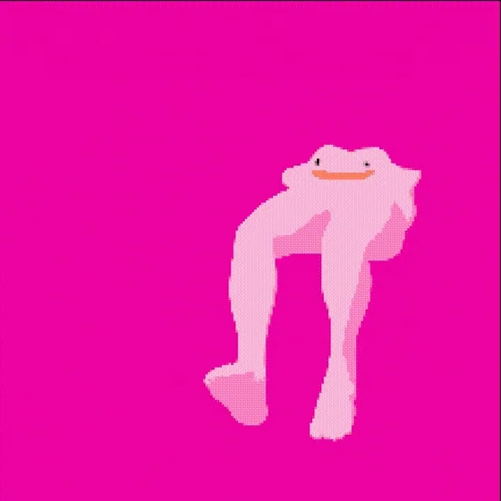

## Hi there 👋

Hi! 👋 I am a Genomic Science student at ENES Juriquilla, currently in my 3rd semester. I’m also a pseudoprogrammer 💻, coding in R, Python, and C++. Additionally, I assist in the development of the [VieRnes de Bioinformática en LIIGH](https://viernesbioinformatica.github.io/) webpage 🌐.

### Missions

-   ✅ RNAseq

-   🔴 Single Cell

-   🔴 ATACseq

-   🔴 Hi-C
